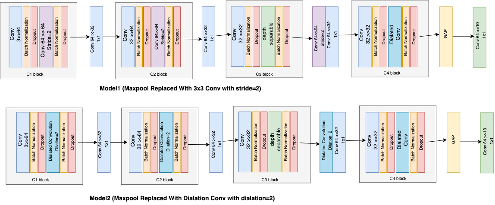
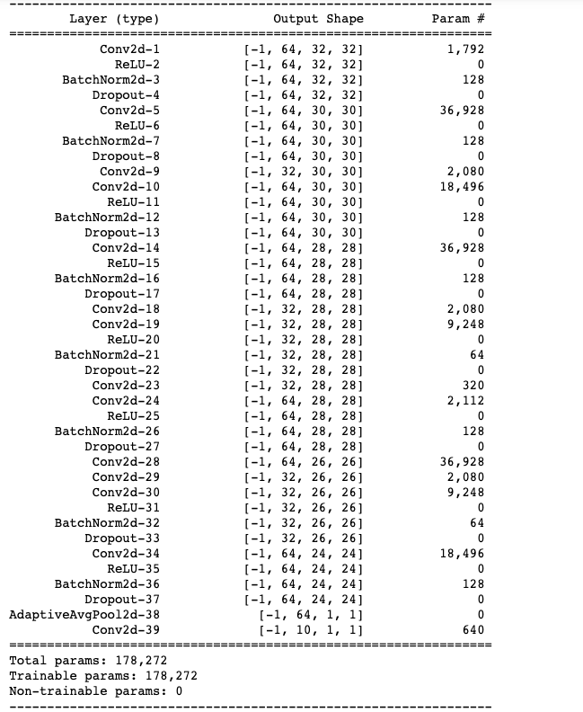
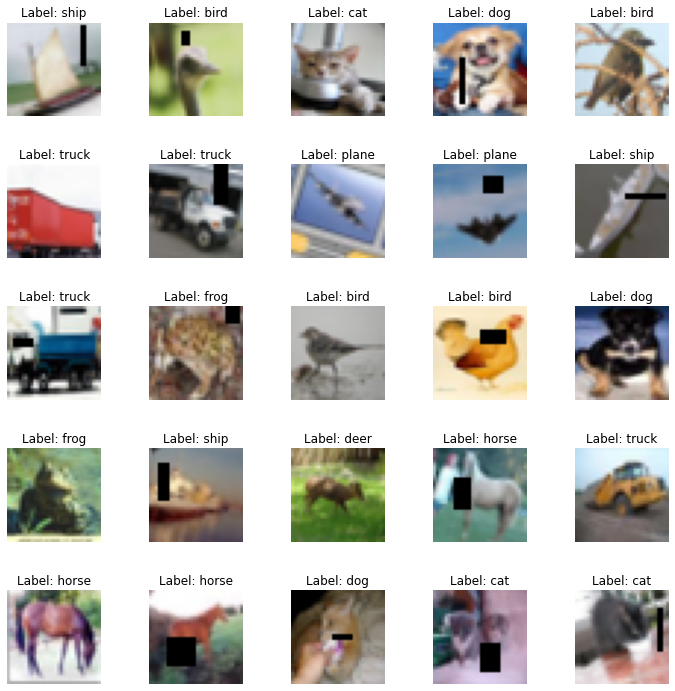
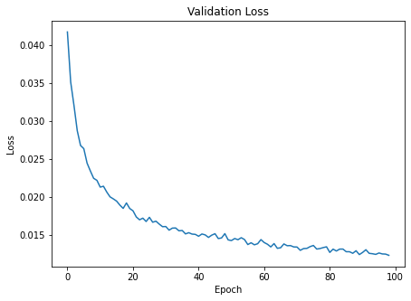
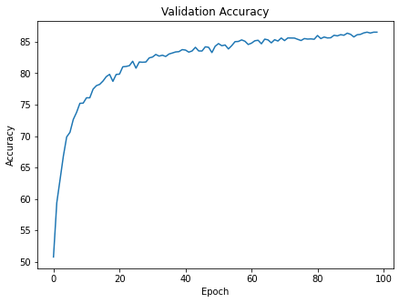
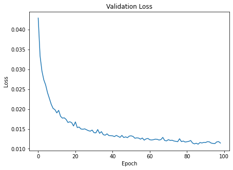
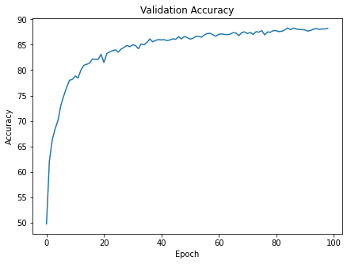

## Assignment Problem
The problem is to design a network that can classify CIFAR-10 images into the correct classes

However there are few constraints to be taken care of 

1. The network should follow the architecture of the form **C1|C2|C3|C4|O**
1. No Max pooling to be used. Make use of 3x3 convolution or the Dilated Convolution

2. One of the layers must use the Depthwise Separable Convolution

3. One of the layers must use the Dilated Convolution

4. Must use GAP

5. Must use the albumentation library for the image augmentation. The augmentations to be used are: horizontal flip, shiftScaleRotate,coarseDropout


6. The accuracy to be achieved: **85%** and the number of params < 200K

7. Total RF must be >44

## Solution

The archiecture makes use of all the contraints as specified. 


## Files:
1. [models/model.py](https://github.com/TSAI-EVA8/advancedConvolutions/blob/main/models/model.py) : Model file where **MaxPooling** has been replaced by stride=2 3x3 convolution
2. [models/modelWithDilation.py](https://github.com/TSAI-EVA8/advancedConvolutions/blob/main/models/modelWithDilation.py) : Model file where **MaxPooling** has been replaced by Dilated Convolution

3. [config.py](https://github.com/TSAI-EVA8/advancedConvolutions/blob/main/config.py): contains the configuration that can be set before training the model

4. [dataUtils.py](https://github.com/TSAI-EVA8/advancedConvolutions/blob/main/dataUtils.py): This caontains the custom dataset class. This is also needed for the albumentation library to work

5. [plottingUtils.py](https://github.com/TSAI-EVA8/advancedConvolutions/blob/main/plottingUtils.py): The functions that are needed to plot the images and the various outputs using matplotlib

6. [utils.py](https://github.com/TSAI-EVA8/advancedConvolutions/blob/main/utils.py): contains mostly the boiler plate code for training and evalution

7. [main.ipynb](https://github.com/TSAI-EVA8/advancedConvolutions/blob/main/main.ipynb): This is the solution file to train the model based on the 3x3 stride=2 convolution kernel

8. [main2.ipynb](https://github.com/TSAI-EVA8/advancedConvolutions/blob/main/main2.ipynb): This is the solution file to train the model based on the dilated convolution


## Architecture

The following C1|C2|C3|C4|O architecture has been followed




## Observations:
1. Both model1 ((maxpool replaced with strided convolution) and model2 (maxpool replaced) dilated convolution has the same number of paramters




2. The model1 (maxpool replaced with strided convolution) achieved the 85% accuracy mark after 65 epoch
```
Epoch 65:
Loss=0.90 Batch_ID=1562 Accuracy=80.82: 100%|████████████████████████████████████████████████████████████████████████████████████████████████████████████████████████| 1563/1563 [00:11<00:00, 136.63it/s]

Test set: Average loss: 0.0132, Test Accuracy: 8543/10000 (85.43%)

Epoch 66:
Loss=0.51 Batch_ID=1562 Accuracy=80.95: 100%|████████████████████████████████████████████████████████████████████████████████████████████████████████████████████████| 1563/1563 [00:11<00:00, 136.91it/s]

Test set: Average loss: 0.0133, Test Accuracy: 8531/10000 (85.31%)

Epoch 67:
Loss=0.46 Batch_ID=1562 Accuracy=80.88: 100%|████████████████████████████████████████████████████████████████████████████████████████████████████████████████████████| 1563/1563 [00:11<00:00, 139.59it/s]

Test set: Average loss: 0.0138, Test Accuracy: 8484/10000 (84.84%)

Epoch 68:
Loss=0.28 Batch_ID=1562 Accuracy=80.98: 100%|████████████████████████████████████████████████████████████████████████████████████████████████████████████████████████| 1563/1563 [00:11<00:00, 138.99it/s]

Test set: Average loss: 0.0135, Test Accuracy: 8534/10000 (85.34%)

Epoch 69:
Loss=1.37 Batch_ID=1562 Accuracy=81.08: 100%|████████████████████████████████████████████████████████████████████████████████████████████████████████████████████████| 1563/1563 [00:11<00:00, 136.81it/s]

Test set: Average loss: 0.0136, Test Accuracy: 8513/10000 (85.13%)

Epoch 70:
Loss=0.62 Batch_ID=1562 Accuracy=80.80: 100%|████████████████████████████████████████████████████████████████████████████████████████████████████████████████████████| 1563/1563 [00:11<00:00, 136.59it/s]

Test set: Average loss: 0.0134, Test Accuracy: 8561/10000 (85.61%)
```


while model2 (maxpool replaced with Dialted convolution) could achieve the 85% accuracy after 34 epochs only

```

Epoch 34:
Loss=0.26 Batch_ID=1562 Accuracy=82.16: 100%|█████████████████████████████████████████████████████████████████████████████████████████████████████████████████████████| 1563/1563 [01:12<00:00, 21.52it/s]

Test set: Average loss: 0.0139, Test Accuracy: 8516/10000 (85.16%)

Epoch 35:
Loss=0.14 Batch_ID=1562 Accuracy=82.33: 100%|█████████████████████████████████████████████████████████████████████████████████████████████████████████████████████████| 1563/1563 [01:12<00:00, 21.47it/s]

Test set: Average loss: 0.0143, Test Accuracy: 8497/10000 (84.97%)

Epoch 36:
Loss=0.67 Batch_ID=1562 Accuracy=82.70: 100%|█████████████████████████████████████████████████████████████████████████████████████████████████████████████████████████| 1563/1563 [01:13<00:00, 21.39it/s]

Test set: Average loss: 0.0135, Test Accuracy: 8546/10000 (85.46%)

Epoch 37:
Loss=0.28 Batch_ID=1562 Accuracy=82.34: 100%|█████████████████████████████████████████████████████████████████████████████████████████████████████████████████████████| 1563/1563 [01:12<00:00, 21.55it/s]

Test set: Average loss: 0.0134, Test Accuracy: 8614/10000 (86.14%)

Epoch 38:
Loss=0.55 Batch_ID=1562 Accuracy=82.86: 100%|█████████████████████████████████████████████████████████████████████████████████████████████████████████████████████████| 1563/1563 [01:13<00:00, 21.37it/s]

Test set: Average loss: 0.0138, Test Accuracy: 8557/10000 (85.57%)

```


So the dilated convolution seems to be better option for the replacement of the Maxpool


3. The training time for model1 was less compared to model2


## Albumentation

The following transformation is what I used:
A.Compose({
        A.ShiftScaleRotate(shift_limit=0.05, scale_limit=0.05, rotate_limit=18, p=0.5),
        A.HorizontalFlip(p=0.5),
        A.CoarseDropout(max_holes = 1,max_width=16,max_height=16,
                        min_height=1,min_width=1,min_holes = 1,
                        mask_fill_value=None,fill_value=0.5),
        A.Normalize((0.5, 0.5, 0.5), (0.5, 0.5, 0.5)),
        })

In order to apply the albumentation ,we need to have a dataset class that will apply the transformation 

```
def __getitem__(self, index):
        ..
        ..

    image = self.transformations(image=np.array(image))['image'] ## need to use np arrays
    image = np.transpose(image, (2, 0, 1)).astype(np.float32) ## need to fix the axis
        ..
        ..
    return torch.tensor(image, dtype=torch.float),label ## converting to tensor before returning
```
This has been used only for the training data and not the testing data

Some of the training images after the transformation :



## Results:

I ran the training for 100 epochs:
* Here is the loss and accuracy with Model1 (maxpool replaced with strided convolution)



 



The maximum test accuracy is about 86.5%. The required test 85% accuracy was achieved after 65th epoch


* However with Model2 (maxpool replaced with Dialted convolution)


 



The maximum test accuracy is about 88.2% and was consistently above test 85% after the 35th epoch


Note: In both the models the test accuracy was more than the training accuracy, which is the result of the image augmentations as the training has become more tough


## Misclassification & Class accuracy
* With Model1 the class accuracy is as follows
```
Accuracy of plane : 86 %
Accuracy of   car : 94 %
Accuracy of  bird : 81 %
Accuracy of   cat : 72 %
Accuracy of  deer : 86 %
Accuracy of   dog : 78 %
Accuracy of  frog : 88 %
Accuracy of horse : 90 %
Accuracy of  ship : 94 %
Accuracy of truck : 91 %
```


* With Model2 the class accuracy is as follows
```
Accuracy of plane : 89 %
Accuracy of   car : 96 %
Accuracy of  bird : 82 %
Accuracy of   cat : 72 %
Accuracy of  deer : 88 %
Accuracy of   dog : 81 %
Accuracy of  frog : 90 %
Accuracy of horse : 93 %
Accuracy of  ship : 94 %
Accuracy of truck : 92 %
```

Both the models could not do better than 72% in case of identifying cats


